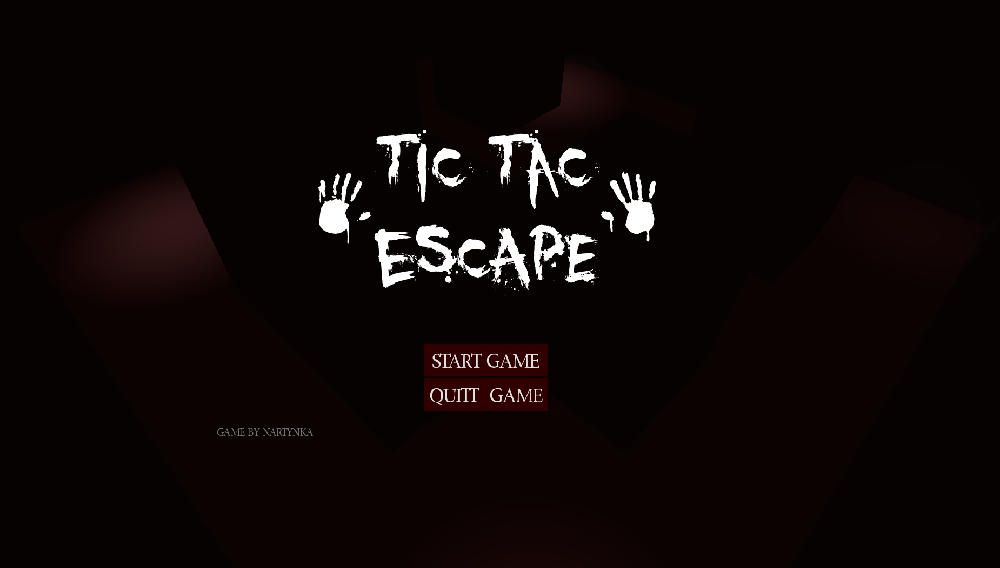
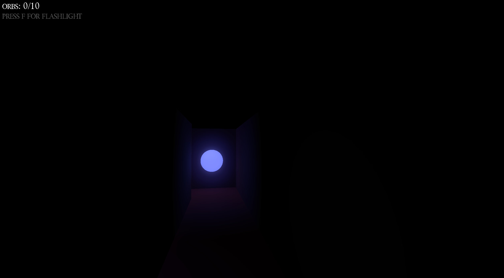
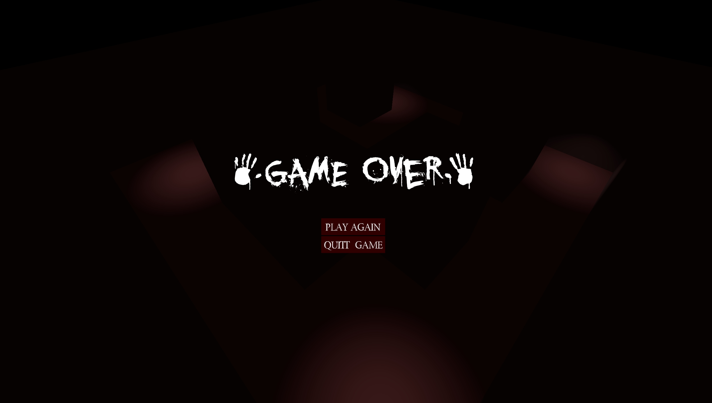

# Tic Tac Escape v2! 👻
I remade this project in Unreal Engine 5. Check it out! [Tic Tac Escape v2!](https://github.com/Nartynka/Tic-Tac-Escape-v2)

# Tic tac Escape

You are in a maze, haunted by a tic tac. You can't hide, it knows where you are, you will hear it when it approaches you. 

To survive you must collect all orbs, they emit sonar sound, you will find them by following the sound. Find them all or tic tac will find you and you will never see the light of day again!

3D horror game made in godot engine.

## Controls
- `WASD` or `Arrow keys` to move
- `Mouse` to look around
- `F` for flashlight

## Screenshots

*More in screenshots folder*
